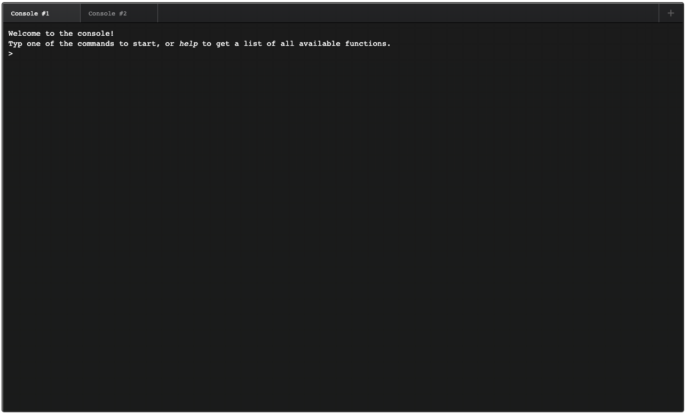

# TypeScriptConsole
A console-like front-end, making use of TypeScript to control its output and input

Purpose
---
This console can be used to quickly setup testing tasks that would normally require your browser.

Out of the box, the console comes with the following commands:
- Opening a page via GET
- Posting to a page using POST
- Running and monitoring an Azure function

Screenshot
---
